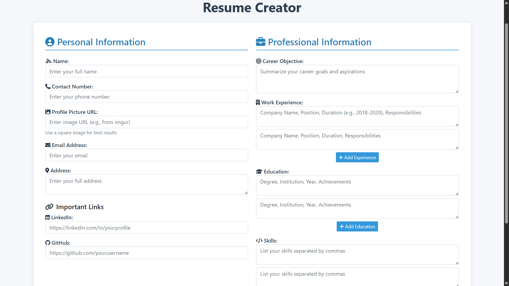

# Resume Builder Web Application



A responsive web application that allows users to create professional resumes by filling out a form. The application generates a well-formatted resume that can be printed or saved as PDF.

## Features

- **User-Friendly Form**: Easy-to-use form with sections for personal and professional information
- **Dynamic Fields**: Add multiple entries for work experience, education, and skills
- **Real-Time Preview**: Instantly generates a professional resume template
- **Responsive Design**: Works on desktop, tablet, and mobile devices
- **Print Functionality**: One-click printing of the generated resume
- **Modern UI**: Clean, professional design with icons and proper spacing

## Technologies Used

- HTML5
- CSS3 (with Bootstrap 5)
- JavaScript (Vanilla JS)
- Font Awesome (for icons)

## Installation

No installation required! This is a client-side only application that runs in the browser.

1. Clone the repository or download the ZIP file:
   ```bash
   git clone https://github.com/yourusername/resume-builder.git

Open index.html in your preferred web browser

How to Use
Fill out all sections in the form:

Personal Information (Name, Contact, etc.)

Professional Information (Objective, Experience, etc.)

Click "Generate Resume" to see your formatted resume

Review your resume and:

Click "Print Resume" to print or save as PDF

Click "Edit Resume" to make changes

Project Structure
Copy
resume-builder/
├── index.html          # Main HTML file
├── style.css           # Main CSS file
├── script.js           # Main JS file
├── README.md           # This documentation file
Customization
To customize the resume template:

Edit the CSS in the <style> section of index.html to change colors, fonts, or layout

Modify the HTML structure in the resume template section for different sections

Update the JavaScript in the <script> section for additional functionality

Future Enhancements
Add PDF export functionality

Include multiple resume templates

Implement local storage to save resumes

Add section for projects/portfolio

Include option to upload profile picture directly

Contributing
Contributions are welcome! Please fork the repository and create a pull request with your improvements.

License
This project is licensed under the MIT License - see the LICENSE file for details.

Note: This is a frontend-only application. All processing happens in the browser - no data is stored or sent to any server.

Copy

This README includes:

1. Project title and visual screenshot (you can add an actual screenshot later)
2. Key features list
3. Technology stack
4. Installation instructions
5. Usage guide
6. Project structure
7. Customization options
8. Planned future features
9. Contribution guidelines
10. License information

You can customize it further by:
- Adding actual screenshots
- Including a demo link if hosted online
- Adding more detailed technical documentation
- Including setup instructions for development
- Adding acknowledgments or credits

Would you like me to modify any particular section or add more details to any part of the README?
